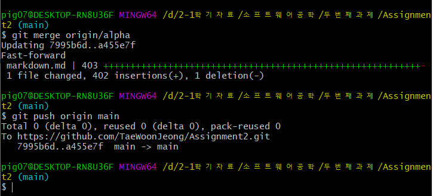
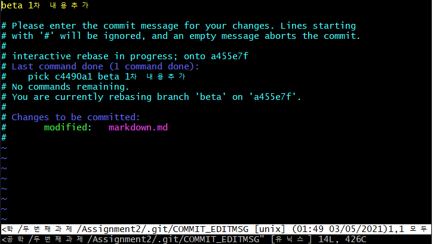

# 저장소 주소
https://github.com/TaeWoonJeong/Assignment2

# 시나리오

# 저장소 만들기
- 깃허브사이트에 가서 로그인을 한뒤 `New repository`를 누른다.

- 저장소 이름을 적은뒤 밑에 부분 잘 보면 `README.md` 파일 추가가 있는데 그것을 체크해준뒤 만든다.

# 저장소랑 로컬이랑 연결하기
- `git clone 저장소주소` 를 하기 위해 저장소 주소를 복사한다.
- `git clone`는 원격 저장소에 있는 파일을 복사해서 로컬저장소로 가져온다.

- clone 하고 싶은 임의의 폴더를 생성한뒤 마우스 우클릭 `Git Bash Here`를 클릭한다.

- `git clone 저장소주소` 를 하면 로컬에 저장소의 이름으로 된 폴더가 만들어지고 그 안에 `main브랜치`에 있는 파일이 복사 되서 들어오고 `.git` 이라는 숨긴폴더가 만들어진다.

- 우리는 `두번째과제` 폴더에 `git bash`를 만들었기 때문에 `git bash` 창을 닫고 안에 있는 `Assignment2`폴더로 들어가서 다시 `git bash`를 열어준다. 그 후 프로젝트인 `markdown.md`를 만들어 준다.

- 만드는 방법은 2가지가 있는데 하나는 `git bash`에서 `touch markdown.md`로 만들거나 일반적인 파일 생성 방법으로 만들 수 있다. 우리는 `touch markdown.md` 명령어를 사용해 만들고 `# 마크다운 프로젝트입니다.` 라고 적어주고 저장한다.

- 그 후 `git status`를 하면 `markdown.md`에 빨간색이 쳐진다.
- `git add markdown.md` 를 해준다.
- `git commit -m "마크다운 프로젝트 최초커밋"` 을 하면 오류가 생긴다.

# Git Bash 사용자 생성하기
- 오류메시지를 보면 `git config --global user.email "you@example.com"`과 
  `git config --global user.name "Your Name"`를 사용하라고 한다.
- `git config --global user.name "TaeWoonJeong"`
- `git config --global user.email "pig07911@naver.com"`
- 로 설정을 해준다.
- `git config --list` 로 설정이 잘 되었는지 확인한다.
- `git config`는 사용자 설정을 해주는 명령어이다.

`config`의 자주 사용할것 같은 옵션
|옵션|설명|
|---|---|
|`git config --global user.name "TaeWoonJeong"`|`global`한 사용자 이름을 `TaeWoonJeong`으로 설정한다.|
|`git config --global user.email "pig07911@naver.com"`|`global`한 사용자 이메일을 `pig07911@naver.com`으로 설정한다.|
|`git config --list`|설정된 내용을 출력한다.|

# 마크다운 프로젝트 커밋 푸시 해보기
- 설정을 다 했으니 커밋과 푸시를 해보겠다.
- `git commit -m "마크다운 프로젝트 최초커밋"`을 한다.
- `git push origin main`을 한다.
- `git commit`은 어떤 순간 작업공간의 상태를 저장한 것이다. 작업공간 안에 있는 모든 파일과 파일의 데이터를 사진 찍듯이 복사해서 저장소에 보존한다. 어떤 시점의 스냅샷이라고 볼수 있다.
- `git push`은 `commit`한것을 실제로 원격 저장소에 올리는 역할을 한다.

- 푸시가 잘 되었는지 저장소에 들어가서 확인한다.

`commit`의 자주 사용할것 같은 옵션
|옵션|설명|
|---|---|
|`git commit-m "메시지"`|메시지라는 `commit`메시지가 등록된다.|
|`git commit -a`|`add`가 된 파일이 수정됬을때 `add`와 `commit`를 한번에 수행한다.|
|`git commit-am "메시지"`|`add`가 된 파일이 수정됬을때 `add`와 `commit`를 한번에 해주고 메시지라는 `commit`메시지가 등록된다.|

# 새로운 브랜치 만들기
- 브랜치를 만들기 위해 다시 `두번째과제` 폴더로 간다.
- 2개의 브랜치를 만들꺼기 때문에 `alpha` 와 `beta` 라는 이름을 가진 폴더 2개를 만들어 준다. `alpha`는 마크다운 기초 문법을 `beta`는 GFM을 설명하겠다.

> ## 저장소랑 연결하기 alpha
> - `alpha` 폴더랑 저장소랑 연결해 보겠다.
> - 연결하기 위해 아까쓴 `git clone` 말고 `git init` 을 사용해 보도록 하겠다.
> - `alpha` 폴더에서 `git bash` 를 열어준다.
> - `git init` 을 쓰면 `.git` 폴더가 생성된다.
> - 이제 저장소랑 연결하기 위해 `git remote add origin 저장소주소`를 사용한다.
> - `git pull origin main` 로 main저장소에 있는 파일들을 가져온다.
> - `git init`은 `.git`파일을 만들어준다.
> - `git pull`은 저장소에있는 파일을 가져올때 사용한다.
> - `git remote`는 로컬에서 저장소를 연결해주는 명령어이다.

`push`의 자주 사용할것 같은 옵션
|옵션|설명|
|---|---|
|`git push -f origin main`|`main`브랜치에 강제로 덮어씌운다. 코드변경이력이 없어지기 때문에 조심해서 써야한다.|

`remote`의 자주 사용할것 같은 옵션
|옵션|설명|
|---|---|
|`git remote add name url`|로컬에서 부를 저장소 이름을 `name`으로 하고 연결하고 싶은 저장소의 `url`을 입력한다.|
|`git remote`|저장소의 목록을 확인한다.|
|`git remote -v`|저장소의 상세 정보를 볼수 있다.|
|`git remote set-url name newurl`|`name`이라고 만들어져 있는 저장소의 주소를 `newurl`로 변경한다.|
|`git remote rename oldname newname`|`oldname`인 저장소의 이름을 `newname`으로 고친다.|

> ## alpha 브랜치 만들기
> - `git branch alpha`로 `alpha브랜치`를 만든다.
> - `git checkout alpha`로 `alpha브랜치`로 이동한다.
> - `git branch`는 현재 저장소의 브랜치를 보여주거나 다른 브랜치를 생성하게 하는 명령어이다.
> - `git checkout`은 다른 브랜치로 이동하게 하는 명령어이다.

> - `markdown.md`를 수정한다. 이미지 설명하기 직전까지 내용을 추가한다.
> - `git status`를 사용해서 파일이 변경됨을 확인하고 `git add markdown.md`를 한뒤 `git commit -m "1차 내용추가"`를 하고 `git push origin alpha` 로 푸시를 한다.
> - `git add`는 작업디렉토리상의 변경내용을 스테이징 영역에 추가하기 위해 사용하는 명령어다.
> - `git status`는 파일의 상태를 확인하는 명령어이다.

`add`의 자주 사용할것 같은 옵션
|옵션|설명|
|---|---|
|`git add *`|변경된 파일 전부 추가해준다. 파일을 삭제해도 삭제한 파일은 `Staging Area`에 남아있다.|
|`git add .`|변경된 파일을 전부 추가해준다. 다만 파일을 삭제하고 사용하면 삭제한 파일은 `Staging Area`에 없어진다.|
|`git add filename`|`filename`이라는 파일이 `Staging Area`에 간다.|

`branch`의 자주 사용할것 같은 옵션
|옵션|설명|
|---|---|
|`git branch`| 브랜치 목록이 나온다.|
|`git branch branchname`|`branchname`이라는 브랜치가 만들어진다.|
|`git branch -m oldbranch newbranch`|`oldbranch`라는 브랜치 이름이 `newbranch`로 변경된다.|
|`git branch -d branchname`|`branchname`이라는 브랜치가 삭제된다.|

`checkout`의 자주 사용할것 같은 옵션
|옵션|설명|
|---|---|
|`git checkout -b feature`|`feature`라는 브랜치가 생성되고 `feature`라는 브랜치로 이동한다.|

> ## 저장소랑 연결하기 beta
> - `beta` 폴더랑 저장소랑 연결해 보겠다.
> - 연결하기 위해 아까쓴 `git clone` 말고 `git init` 을 사용해 보도록 하겠다.
> - `beta` 폴더에서 `git bash` 를 열어준다.
> - `git init` 을 쓰면 `.git` 폴더가 생성된다.
> - 이제 저장소랑 연결하기 위해 `git remote add origin 저장소주소`를 사용한다.
> - `git pull origin main` 로 `main저장소`에 있는 파일들을 가져온다.

> ## beta 브랜치 만들기
> - `git branch beta`로 `beta브랜치`를 만든다.
> - `git checkout beta`로 `beta브랜치`로 이동한다.

> - `markdown.md`를 수정한다. 자동링크 직전까지 내용을 추가한다.
> - `git status`를 사용해서 파일이 변경됨을 확인하고 `git add markdown.md`를 한뒤 `git commit -m "beta 1차 내용추가"`를 하고 `git push origin beta` 로 푸시를 한다.

# merge로 병합하기

## alpha에서 main으로 병합하기
- `main`의 `markdown.md` 와 `alpha`의 `markdown.md`를 병합하겠다.
- `git clone` 한 `Assignment2`폴더에 가서 `git Bash`를 열어준다.
- 아직 `main브랜치`는 다른 브랜치의 최신 이력을 모르기 때문에 `git fetch`를 사용한다.

- `git merge origin/alpha` 를 해준다.
- `git push origin main`을 해준다.
- `git merge`는 서로다른 브랜치에 있는 같은 파일을 병합해주는 역할을 한다.

## beta에서 main으로 병합하기
- `main`의 `markdown.md` 와 `beta`의 `markdown.md`를 병합하겠다.
- `git clone` 한 `Assignment2`폴더에 가서 `git Bash`를 열어준다.
- `git merge origin/beta`를 한다.
- `main`의 `markdown.md`는 `alpha`의 `markdown.md`를 합친상태에서 `beta`의 `markdown.md`와 병합할려면 서로 내용이 다르기 때문에 오류가 생긴 것이다.

- 충돌을 해결하기 위해 `Assignment2`폴더의 `markdown.md`를 들어가보면 위에는`<<<<<<< HEAD` 그리고 아래에는 `>>>>>>> origin/beta` 이렇게 붙어있다. 그리고 `alpha`내용의 끝부분과 `beta`내용의 시작부분에는 `=======` 이렇게 들어가 있다. 이것들을 전부 지운뒤 저장을 한다.
- `git add markdown.md`를 하고 `git commit -m "beta와 첫병합"`을 한뒤 `git push origin main`을 해준다.

# rebase로 병합하기

- `merge`로 하는 방법 말고 `rebase`로 하는 방법이 있다.
- 우선 방금 했던 `merge`를 취소시키기 위해 `Assignment2`폴더에서 `git Bash`를 열어준뒤 `git reset --hard HEAD~`를 해준다.
- `git push origin main` 을 통해 푸시해준다. 하지만 push 가 되지 않으므로 강제로 푸시를 하겠다. `git push -f origin main`를 통해 강제로 푸시해준다.
- `git rebase`는 다른 브랜치를 베이스로 병합을 진행해주는 명령어이다.
- `git reset --hard HEAD~`는 현재 `HEAD`가 가리키는 위치를 한단계 전으로 다시 옮기는 명령어이다.

- 강제로 푸시해줘서 `beta`와 병합한 커밋내역도 없어진다
- `Assignment2`폴더에서 `git Bash`를 열고 `git checkout beta`를 하고 `git rebase main`을 해준다. 역시 충돌이 발생한다.

- 충돌해결은 `merge`를 사용했을때와 똑같이 처리해 준다.
- `git add markdown.md`를 하고 `git rebase --continue`를한다.
- 그러면 아래와 같은 창이 뜬다 `commit` 메시지 적으라는 뜻이다. "rebase로 병합하기" 라고 적어주고 `:wq`를 통해 저장하고 닫는다.

- 현재 `beta`의 `markdown.md`로 `main`의 `markdown.md`가 추가된 것이다. `git push origin beta`이 또한 push가 되지 않으므로 `git push -f origin beta`를 해서 강제로 푸시 해준다. github에 반영된 결과를 봐보자.

- 이제 `main`을 `beta`와 병합하면 된다.
- `git checkout main`을 하고 `git merge origin/beta`를 하고 `git push origin main`을 한다.

`rebase`의 자주 사용할것 같은 옵션
|옵션|설명|
|---|---|
|`git rebase branchname`|브랜치이름에 `rebase`를 실행한다.|
|`git rebase --continue`|충돌이 발생하면 충돌부분을 고치고 `git add filename`을 한 뒤 사용한다.|
|`git rebase --abort`|`rebase` 자체를 취소할때 사용한다.|

# merge와 rebase의 차이점
- 위에서 `merge`는 그림으로 그려보면
      
      1.      2.
      HEAD    HEAD
        |       |
      main    main----------->alpha
                      |
                      |------>beta

      3.
                        HEAD
                         |
      main---------->main=alpha
              |
              |----->beta

      4.
                                           HEAD
                                            |
      main---------->alpha---------->main=alpha+beta
              |                |
              |----->beta------|
- `reset --hard HEAD~`를 하고 `git rebase master`를 한 모습을 그림으로 그려보면

      1.
                        HEAD
                         |
      main---------->main=alpha
              |
              |----->beta
      2.
                                          HEAD
                                            |
      main--------->main=alpha------>beta=alpha+beta
      3.
                                          HEAD
                                            |
      main--------->main=alpha------>main=alpha+beta
- 이렇게 된다.

# main에 태그붙이기 1번째
- `Assignment2`폴더에 가서 `git Bash`를 열어주고 `main`브랜치인지 확인한다.
- 아니라면 `git checkout main`으로 이동해 준다.
- 1차로 `merge`를 했으므로 `git tag 버전1`이라고 하면 버전1이라는 태그가 생긴다.
- `git push --tags`로 모든 태그를 올려준다.
- `git push origin 버전1`이라고 하면 `버전1`이라는 태그만 올라간다.
- `git tag`는 현재 커밋한 곳의 태그를 붙이는 명령어이다.

# alpha 작업 끝내기
- `alpha` 폴더에 간다.
- `alpha`의 작업을 계속 하면 `image`라는 폴더와 사진이 필요하다. 이것을 `과제1`에서 사용한 폴더를 가져오고 `markdown.md`의 남은 부분을 적겠다.
- 다 했으면 `git status`를 해서 어떤게 바뀐지 확인해주고 `image`폴더와 `markdown.md`두개가 변경되었으므로 `git add *`를 해준뒤 `git commit -m "alpha 작업 끝"` 이라고 한뒤 `git push origin alpha`를 한다.

# beta 작업 끝내기
- `beta` 폴더에 간다.
- `beta`의 `markdown.md`의 남은 부분을 적겠다.
- 다 했으면 `git status`를 해서 어떤게 바뀐지 확인해주고 `markdown.md`만 바뀌었으므로 `git add markdown.md`를 해준뒤 `git commit -m "beta 작업 끝"`이라고 한뒤 `git push origin beta`를 한다.

# main에 alpha를 최종병합하기
- `rebase` 말고 `merge`를 사용해 병합할 것이다.
- `Assignment2` 폴더에 가서 `git fetch`를 해준뒤 `git merge origin/alpha`
를 해준다. 그러면 충돌이 발생하는데 이유는 `main`의 `markdown.md`에는 `alpha` 1차 내용이 있고 그 밑에 `beta` 1차 내용이 있는데 `alpha`의 `markdown.md`만 고쳐서 충돌이 발생한 것이다. 
- 내가 원하는 충돌 해결은 `main` 의 `markdown.md`내용에서 `alpha` 1차 내용과 `beta` 1차 내용 사이에 `alpha` 2차 내용을 넣는 것이다.
- 수정을 한다음 `git add markdown.md`를 하고 `git commit -m "alpha와 최종병합 완료"`를 하고 `git push origin main`을 한다.

# main에 beta를 최종병합하기
- `alpha`와 병합할때 충돌이 생기므로 같은 이유로 `beta`도 충돌이 생길 것이다.
- `git merge origin/beta`를 해준다. `main`의 `markdown.md`의 맨 마지막에 `beta`의 `markdown.md`를 추가해 주면 된다. 이렇게 충돌을 해결한뒤 `git add markdown.md`를 하고 `git commit -m "beta와 최종병합 완료"`를 하고 `git push origin main`을 한다.

# main에 태그 붙이기 2번째
- `Assignment2`폴더에 가서 `git Bash`를 열어주고 `main`브랜치인지 확인한다.
- 아니라면 `git checkout main`으로 이동해 준다.
- 2번째 `merge`를 했으므로 `버전2`라는 태그를 쓰겠다.
- `git tag 버전2`로 태그를 만들어준다.
- `git push origin 버전2`이라고 하면 `버전2`이라는 태그만 올라간다.
- `git tag`로 전체 태그를 확인한다.

# 브랜치마다 log 확인하기
- `main`브랜치의 로그다.
- `git log`는 브랜치의 커밋한 이력을 볼수 있는 명령어이다.

- `alpha`브랜치의 로그다.

- `beta`브랜치의 로그다.

`log`의 자주 사용할것 같은 옵션
|옵션|설명|
|---|---|
|`git log -p -숫자`|숫자는 최근 몇개의 결과를 뜻하고 `-p`는 각 커밋의 차이를 보여준다.|
|`git log graph`|브랜치의 log정보를 그래프로 보여준다.|
|`git log --stat`|각각의 커밋에서 수정된 파일의 통계를 보여준다.|

# tag 사용하기
- `Assignment2` 폴더에서 `git Bash`를 열어준다.
- `git tag` 를 입력하면 `tag`가 전부 나온다.

- `git show 버전1`을 입력하면 `버전1` 태그의 `commit`내역이 나온다.

- `git show 버전2`을 입력하면 `버전2` 태그의 `commit`내역이 나온다.

`tag`의 자주 사용할것 같은 옵션
|옵션|설명|
|---|---|
|`git tag`|tag리스트를 보여준다.|
|`git show tagname`|tagname의 태그정보를 확인할 수 있다.|
|`git tag -d tagname`|tagname이라는 태그를 삭제한다.|
|`git push origin tagname`|tagname이라는 태그를 푸시한다.|
|`git push origin --tags`|전체 태그를 푸시한다.|

# 마무리
- `Assignment2` 폴더에 가서 시나리오를 만들때 사용한 이미지 파일을 추가하고 `README.md`를 업데이트 해준다. `git Bash`를 열어주고 `main`브랜치 인지 확인해 준뒤 `main`브랜치가 아니라면 `git checkout main`을 해주고 `main`이 맞다면 `git add *`해주고 `git commit -m "시나리오 업데이트"`한뒤 `git push origin main` 해준다.

|명령어 | 사용 여부|
|--- | ---|
|[add](#alpha-브랜치-만들기)|o|
|[branch](#alpha-브랜치-만들기)|o|
|[checkout](#alpha-브랜치-만들기)|o|
|[clone](#저장소랑-로컬이랑-연결하기) |o|
|[commit](#마크다운-프로젝트-커밋-푸시-해보기)|o|
|[config](#Git-Bash-사용자-생성하기) |o|
|[init](#저장소랑-연결하기-alpha) |o|
|[log](#브랜치마다-log-확인하기) |o|
|[merge](#merge로-병합하기)|o|
|[pull](#저장소랑-연결하기-alpha)|o|
|[push](#마크다운-프로젝트-커밋-푸시-해보기)|o|
|[rebase](#rebase로-병합하기)|o|
|[remote](#저장소랑-연결하기-alpha)|o|
|[reset --hard](#rebase로-병합하기)|o|
|[status](#alpha-브랜치-만들기)|o|
|[tag](#main에-태그붙이기-1번째)|o|